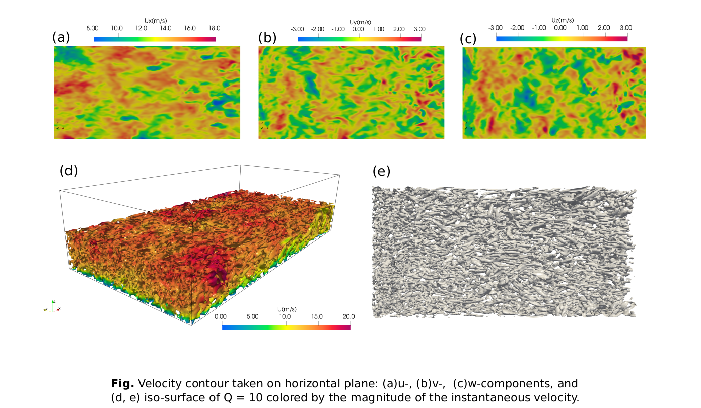

# DFSR

[](https://zenodo.org/badge/latestdoi/300517389)

Divergence-free Spectral Representation (DFSR) method is an inflow/inlet turbulence generation method developed for large-eddy simulation of the atmospheric boundary layer(ABL) flows. The technique uses the spectral representation method to generate ABL-like turbulence with prescribed two-point flow statistics. The code is developed as a utility application using OpenFOAM's framework. DFSR  offers the following key features:

- Capable of running on **unstructured** meshes
- Uses **LAPACK** subroutine for efficient matrix factorization 
- Employes the **FFT** technique for faster time-series computation 
- Parallel implementation using **OpenMPI**    

In this version of the code, the divergence-free condition is imposed on the generated turbulence by adding a gradient of a velocity potential, following the procedure developed by *Shirani et al.(1981)*(similar to approach used in the paper). The final velocity field is written for each time step in the corresponding case directory. Mathematical details of the implemented procedure can be found in [Melaku and Bitsuamlak(2021)](https://www.sciencedirect.com/science/article/pii/S0167610521000660). If you find this work useful in your research and use the DFSR method or parts of it in your work, please do not forget to cite the paper. 



## Installing DFSR
### Requirements
Before compiling the source code, you need to have the following packages already installed. 
- **OpenFOAM**, preferably v8  
- Intel's oneAPI MKL package or **LAPACK** library

    Download the installer here: https://www.intel.com/content/www/us/en/developer/tools/oneapi/base-toolkit-download.html?operatingsystem=linux&distributions=webdownload&options=online
    
    Follow the Command Line Download and Installation instructions (`sudo` is not required, but we only selected the MKL package to install - 7.3 GB) \
    And make sure to follow these instructions: https://www.intel.com/content/www/us/en/develop/documentation/get-started-with-dpcpp-compiler/top.html \
    i.e. source the environment settings script (in our case that worked with `$ source $HOME/intel/oneapi/setvars.sh intel64` but might be dependent on where you installed it - also, you might want to add this line to the end of your `~/.bashrc` file, as it needs to be sourced every time you open a new terminal window)

- Fastest Fourier Transform in the West(**FFTW**) package

    Download the source code from here: `wget https://www.fftw.org/fftw-3.3.10.tar.gz`
    and in the un-zipped folder run the following:
    
    `$ ./configure`\
    `$ make`\
    `$ sudo make install`

### Build from source  

Follow the following procedure to compile the source code. 

- Clone the code to your computer:

   `$ git clone https://github.com/abiyfantaye/DFSR.git DFSR` 

- Copy the `DFSR/src/DFSRTurb` directory to `$WM_PROJECT_USER_DIR/applications/utilities/preProcessing/`:

    `$ mkdir -p $WM_PROJECT_USER_DIR/applications/utilities/preProcessing`\
    `$ cp -r DFSR/src/DFSRTurb $WM_PROJECT_USER_DIR/applications/utilities/preProcessing/`

- Compile the code in `$WM_PROJECT_USER_DIR/applications/utilities/preProcessing/DFSRTurb` directory:

    `$ cd $WM_PROJECT_USER_DIR/applications/utilities/preProcessing/DFSRTurb`\
    `$ chmod +x Allwclean`\
    `$ chmod +x Allwmake`\
    `$ sh ./Allwclean`\
    `$ sh ./Allwmake`

The turbulence generator is now fully embedded in OpenFOAM and can be launched as `DFSRTurb` in serial or parallel. If you have trouble installing this application, please drop an email to amelaku@uwo.ca .

## Simulation Example
Directory tree of `example/openTerrain`: 
```bash
├── 0
│   ├── nut
│   ├── p
│   └── U
├── constant
│   ├── boundaryData
│   │   └── windProfile
│   │       ├── profile
│   │       └── sampledData
│   │           ├── samplingPoints
│   │           └── vtkSlices
│   ├── DFSRTurbDict
│   ├── transportProperties
│   └── turbulenceProperties
├── setUp
└── system
    ├── blockMeshDict
    ├── controlDict
    ├── decomposeParDict
    ├── fvSchemes
    ├── fvSolution
    ├── probes1
    └── probes2
```
### Input parameters 

The directory `example/openTerrain` contains an empty domain LES case configured for open terrain conditions. The basic parameters for the DFSR method are defined in `constant/DFSRTurbDict`. The method reads the ABL profile from `constant/boundaryData/windProfile/profile` file. This file specifies the variation of the mean velocity, turbulence intensities, and length scales over the height in the following tabular format: 

| z[m]  | Uav[m/s] |  Iu   |   Iv   |   Iw   | Lu [m] | Lv[m]  | Lw[m]  |
| ----- | -------- | ----- | ------ | ------ | ------ | ------ | ------ |
| 0.02  | 14.56    | 0.160 | 0.120  | 0.120  | 0.750  | 0.500  | 0.300  |
| ..... | .......  | ..... | .....  | .....  | .....  | .....  | .....  |
| ..... | .......  | ..... | .....  | .....  | .....  | .....  | .....  |

The parameters that need to be defined in `constant/DFSRTurbDict` dictionary are: 

| Parameter | Description | Optional | Default |
| --- | --- | --- | --- |
| `patchName` | Name of the patch to apply the inflow | no | -- |
| `startTime` | Starting time of the generated turbulence | yes | 0.0|
| `endTime` | Ending time of the generated turbulence  | no | --|
| `timeStep` | Time step of the inflow, can be different from the solver time step. It should be `1/(2*fMax)` to take advantage of the FFT algorithm. | no | --|
| `fMax` | The cut-off frequency | no | --|
| `nFreq` | The number of frequency steps/segments | no | 1024 |
| `nInterp` | Number of spectral interpolation frequencies | no | 50 |
| `seed` | Seed of the random number generator used to sample random phase angles. | yes | -- |
| `C` | Coherency decay coefficients.  | no | --|
| `cohUav` | Mean velocity used to define the coherency function | yes | --|
| `scaleI` | A factor to scale turbulence intensity profiles in each direction to account for the decay of turbulence downstream in the CFD simulation. | yes |(1 1 1)|
| `scaleL` | A factor to scale integral length scale profiles in each direction. | yes | (1 1 1) |
| `correctDivergence` | Apply div-free corrections or not | yes | on |
| `writeSamples` | Write data for selected sampling points or not | yes | on |
| `writeInflow` | Write the final inflow data or not| yes | on |

### Output 
Finally, if the controle `writeInflow` is turned on, the whole inflow data is saved in `constant/boundaryData/<patchName>/` directory. This inflow data is later read by the solver with `timeVaryingMappedFixedValue` velocity boundary condition at the inlet. Please check the OpenFOAM test case in `example/openTerrain` directory for the details. 

If `writeSamples` is turned on, the code reads sampling points from `constant/boundaryData/windProfile/sampledData/samplingPoints`. Then, the time-series of the generated velocity components for each point in `samplingPoints` are written into `Ux`,`Uy`, and `Uz` files in the same directory. In addition, the velocity field over the inflow patch is written to VTK slices for selected time instances in the same directory. 


### Excuting the test case 

Follow the following procedure to run the test case in `example/openTerrain` directory: 

- Generate block mesh:

   `$ blockMesh`

- Decompose the case:

   `$ decomposePar` 

- Run the DFSR inflow generator in parallel:

   `$ mpirun -np 4 DFSRTurb -parallel` 
   
- Check the generated samples on paraview:

   `$ paraview constant/boundaryData/windProfile/sampledData/vtkSlices/Ut_*` 

- Finally run the LES case:

   `$ mpirun -np 4 pisoFoam -parallel` 
 
## Reference 
[1] Melaku, A.F. and Bitsuamlak, G.T., 2021. A divergence-free inflow turbulence generator using spectral representation method for large-eddy simulation of ABL flows. Journal of Wind Engineering and Industrial Aerodynamics, 212, p.104580.

[2] Shirani, E., Ferziger, J.H. and Reynolds, W.C., 1981. Mixing of a passive scalar in isotropic and sheared homogeneous turbulence. Mosciences Division, Department of Mechanical Engineering, Stanford University.
